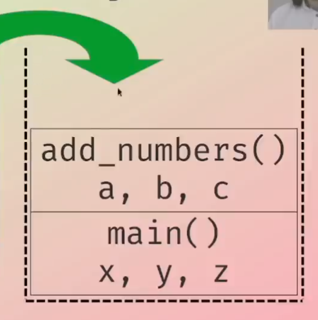
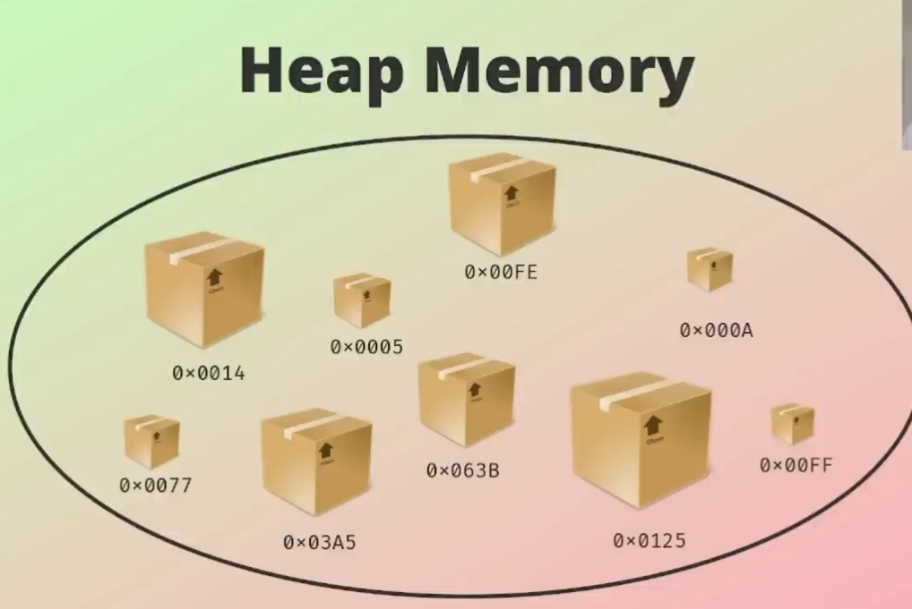

# Ownership in Rust

The concept of ownership is peculiar to Rust and it is very logical and easy to understand.

* Rust ownership system is unique and sets it apart from other programming languages.

* Set of rule that govern memory management.

* Rules are enforced at compile time.

* If any of the rules are violated, the program won't compile.

## Three Rules of Ownership in Rust

1. Each value in Rust has an owner.

2. There can only be one owner at a time.

3. When the owner goes out of scope, the value will be dropped.

__Owner__: ```The owner of a value is the variable or data structure that holds it and is responsible for allocating and freeing the memory used to store that data.```

## Scope

Scope within a program for which an item is valid.

* __Global Scope__:
The Global scope is accessible through out the entire program.

* __Local scope__:
The local scope is accessible only within particular function or block of code an not accessible outside of that function or block.

### Code Block Explanation

```{   // s is not valid here because it is not yet declared
    let s = "hello"; // s is valid from this point forward 

    // do stuff with s

} // this scope is now over, and s is no longer valid
```

* When s comes into scope, it is valid.
* it remains valid until it goes out of scope.
* __General rule__: Scope ends where block of code ends (curly brackets)

## Memory

* Component in a computer to store data and instructions for the processor to execute.

* `Random Access Memory (RAM)` is temporary and volatile storage, when power is turned off all contents are lost.

* Two types of regions in `RAM` used by the program at runtime: `Stack` memory and `Heap` memory.

### Stack Memory
The stack memory uses the Last In First Out (`LIFO`) route to process data, meaning that the last object that was put into the data structure would be the first to be withdrawn.

* All data stored on the stack memory must have a fixed size (e.g. `integers`, `floats`, `bool`, `char`, etc...).

* Pushing  to the stack is faster than allocating to the heap, because the location for new data is always at the top of the stack.

* Type of unknown size will get allocated to the heap and a pointer to the value is pushed to stack, because a pointer is fixed in size `(usize)`.

#### Code Example

```
fn main() {
    let x = 42;
    let y = 10;
    let z = add_numbers(x, y);

    println!("The result is {}", z);
}

fn add_numbers(a: i32, b: i32) -> i32 {
    let c = a + b;
    c
}
```



## Heap Memory



* Data of no known, fixed size belongs on the heap.

* Allocating data on the heap will return a pointer (an address to location where data has been allocated)

* Allocating on the heap is slower than pushing to stack.

* Accessing data on the heap is also slower, as it has to be accessed using a pointer which points to an address.
