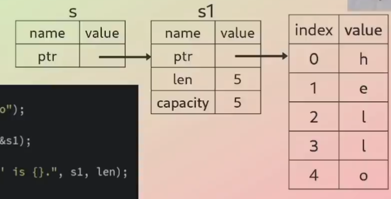

# Borrowing in Rust

* Way of temporarily access data __without taking ownership__ of it.

* When borrowing, you're taking a reference (pointer) to the data, not the data itself.

* Prevention of dangling pointers and data races.

* Data can be borrowed __immutabily__ and __mutably__.

* There are certain rules when borrowing which we have to comply with, otherwise the program won't compile.

 
## Rules of References

1. At any given time, you can have either __one mutable reference__ or __any number__ of __immutable references__.

2. References must __always be valid__.

#### Example of Reference
```
fn main() {
    let s1 = String::from("hello");

    let len = calculate_length(&s1);

    println!("The length of '{}' is {}", s1, len);
}


fn calculate_length(s: &String) -> usize {
    s.len()
}
```

In the code above `s1` is a string variable with its content on the `heap`, and `s1` is on the `stack` with the ptr or address of the first data in the content which is `h`, and also the `length` of the data, and lastly the capacity. While `s` holds a reference to `s1` and not the actual data content. `s` is another pointer that points to the `s1` variable.



<br/>

### Example of Mutable Reference

```
fn main() {
    let mut s = String::from("hello");

    change(&mut s);
}

fn change(some_string: &mut String) {
    some_string.push_str(", world");
}
```

<br/>

### Example Borrowing Rules

```
let mut s = String::from("hello");

let r1 = &mut s;
let r2 = &mut s;

println!("{}, {}", r1, r2);
```

This would __violate the first rule__ of __borrowing__, which says that we can only have __ONE mutable reference__ to the same data at a time!

<br/>

```
let mut s = String::from("hello");

{
    let r1 = &mut s;
    // r1 goes out of scope here, so we can make a new reference with no problems.
}

let r2 = &mut s;
```
<br/>

```
let mut s = String::from("hello");

let r1 = &s; // no problem
let r2 = &s;  // no problem
let r3 = &mut s; // BIG PROBLEM

println!("{}, {}, and {}", r1, r2, r3);
```

This would __violate the first rule__ of __borrowing__, which says that we can either have __any number__ of immutable reference or __one single mutable__ references.

<br/>

```
let mut s = String::from("hello");

let r1 = &s; // no problem
let r2 = &s;  // no problem

println!("{} and {}", r1, r2);
// variables r1 and r2 will not be used after this point

let r3 = &mut s; // no problem

println!("{}", r3);
```

#### Example of Dangling Reference

```
fn main() {
    let reference_to_nothing = dangle();
}

fn dangle() -> &String {
    let s = String::from("hello");
    &s  // returning a reference to a string
} // s is out of scope here, so `&s` points to a variable that is out of scope (garbage value).
```

This will __violate__ the __second rule__ which states that references must __ALWAYS__ be __valid__.

<br/>

##### Correct Code
```
fn main() {
    let reference_to_nothing = dangle();
}

fn dangle() -> &String {
    let s = String::from("hello");
    s
}
```


#### Ref

`ref` can be used to take references to a value, similar to &.

#### Mutability

Error: Borrow an immutable object as mutable. This would not work, you can only borrow a mutable object as mutable.

```
fn main() {
    let s: String= String::from("hello, ");

    borrow_object(&mut s);

    println!("Success!");
}

fn borrow_object(s: &mut String) {}

```
The code above would not work, because we are borrow an immutable object as mutable.

##### Correct Code
```
fn main() {
    let mut s: String= String::from("hello, ");

    borrow_object(&mut s);

    println!("Success!");
}

fn borrow_object(s: &mut String) {}
```

It is okay to borrow a mutable object as immutable. This would work.

```
fn main() {
    let mut s = String::from("hello, ");

    borrow_object(&s); // Immutable references

    s.push_str("world"); // mutating s because it is mutable.

    println!("Success!");
}

fn borrow_object(s: &String) {

}
```

